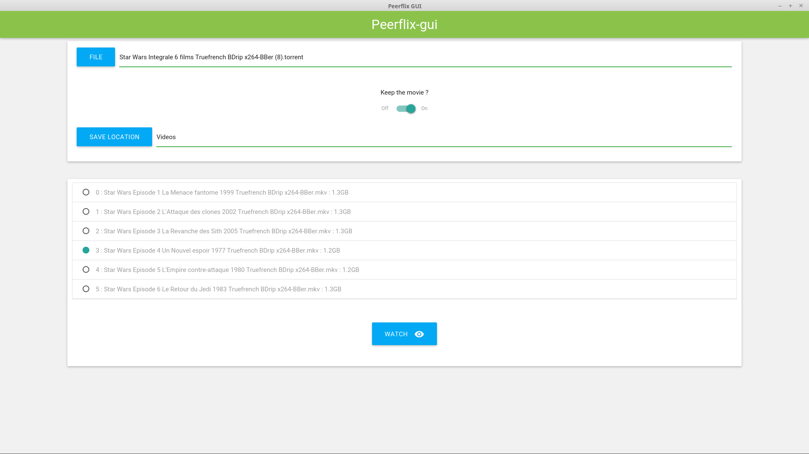

# peerflix-gui

## Motivation

Originally for my girlfriend who have difficulties to use the terminal :)

This sofware is developed using nwjs.

## Installation
### From the source

zip all the file (excluded ``` /bin /README.md /LICENSE ``` and all git specific files)
Rename the .zip file into .nw

### Start the software

Simply execute with nw

```
nw ~/path/to/yourFile.nw
```

## Screenshot


